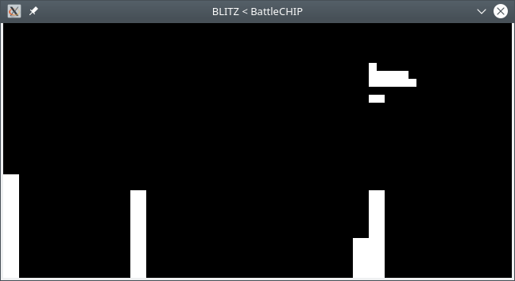

# BattleCHIP

BattleCHIP is a CHIP-8 emulator written in OCaml.

## Compilation

Install OCaml and OCamlSDL, then run `make`.

### On Ubuntu

```bash
sudo apt install ocaml
sudo apt install libsdl-ocaml-dev
sudo apt install make
make
```

## Usage

```terminal
./battlechip path/to/rom
```

### Controls

Use the numpad keys: <kbd>0</kbd>-<kbd>9</kbd>, <kbd>/</kbd>, <kbd>*</kbd>, <kbd>-</kbd>, <kbd>+</kbd>, <kbd>Enter</kbd>, and <kbd>.</kbd>.

Press <kbd>P</kbd> to pause the emulator.

## Screenshots



